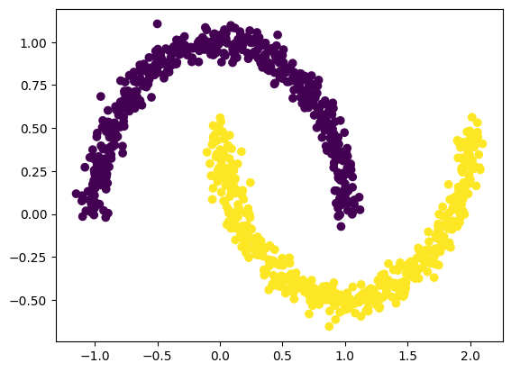
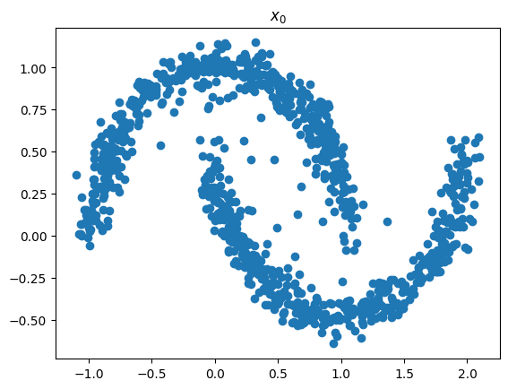

# Denoising Diffusion Probabilistic Models from scratch

This repository contains simple from scratch implementations of Denoising Diffusion Probabilistic Models for small toy examples that can easily be run on a local machine without GPU.

The repository uses
* Python 3.9
* PyTorch 1.13.1

The repository contains the following files:
* `denoising-diffusion-probabilistic-model.ipynb`: From scratch implementation of the 2020 paper "Denoising Diffusion Probabilistic Models" by Jonathan Ho, Ajay Jain, and Pieter Abbeel for the two moons data set (see below).
* `conditional-denoising-diffusion-probabilistic-model.ipynb`: Same as above but we can condition on some context information (which moon to sample from in this case).

